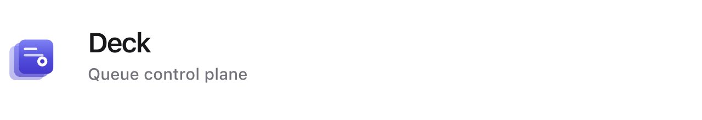

<p align="center">
  
</p>

# Deck

**Job-class observability and safe cancellation for Laravel apps running [Horizon](https://laravel.com/docs/horizon).**

> Horizon flies the workers. Deck runs the operation.

Deck is a **durable control plane** on top of Horizon: per job-class history, searchable executions, cooperative cancel, dispatch blocking, and optional **[Deck Cloud](https://deckapp.cloud)** when you run many services. It does not replace `php artisan horizon`.

---

## Quick start

```bash
composer require deck/deck
php artisan deck:install
php artisan migrate
```

Open `/deck`. Reuse Horizon’s authorization gate by default.

```env
DECK_PROJECT=billing-api
DECK_ENVIRONMENT=production
```

Optional Cloud agent (three variables):

```env
DECK_API_KEY=your-agent-token
```

---

## Documentation

| Guide | |
|-------|---|
| [Getting started](docs/getting-started.md) | Install, migrate, Horizon auth, assets |
| [Horizon & Deck](docs/horizon.md) | What each tool is for |
| [Usage](docs/usage.md) | Dashboard, cancel, block, retry, alerts |
| [Production](docs/production.md) | Dedicated DB, retention, Redis, security |
| [Configuration](docs/configuration.md) | Environment variables and config keys |
| [Deck Cloud](docs/deck-cloud.md) | Multi-app control plane and agent API |

Also on **[deckapp.cloud/docs](https://deckapp.cloud/docs)** when published.

**Changelog:** [CHANGELOG.md](CHANGELOG.md) · **Security:** [SECURITY.md](SECURITY.md)

---

## Why Deck?

| Horizon gives you | Deck adds |
|-------------------|-----------|
| Worker supervision and auto-balancing | Per job-class **last run** and status |
| Recent jobs in Redis (short retention) | **Durable execution log** in your database |
| Failed job retry UI | **Search and filter** by class, queue, connection, tag |
| Throughput and wait-time metrics | **Cooperative cancel** and **block job classes** |
| — | **Stale-job** and **unprocessed-queue** alerts |

Every row is scoped by `project` and `environment` for multi-app teams and Deck Cloud.

---

## Requirements

PHP 8.3+ · Laravel 11–13 · Database · Redis (queues + cancel/block flags) · [Horizon](https://laravel.com/docs/horizon) 5.x recommended

---

## Development

```bash
composer test
```

---

## License

MIT © [Tor Morten Jensen](https://github.com/tormjens). See [LICENSE.md](LICENSE.md).
